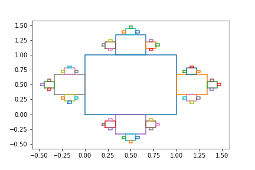

# Square fractals

By ([@mirluvams](https://github.com/mirluvams)) ([mirluvams@gmail.com](mailto:mirluvams@gmail.com)), student at [*Escuela Nacional de Estudios Superiores*, campus Morelia](https://www.enesmorelia.unam.mx/), [UNAM](https://www.unam.mx/).

## Problem
This problem consists in replicating a square fractal showcased in the Dynamic Systems 2022-2 class taught by Dr. [Victor de la Luz](https://github.com/itztli).

## Methodology
The problem was solved by subdividing itself into a pair of functions which can be applied recursively in order to solve the fractal. These two functions take care of drawing a square given a bottom left corner and the lenght of its side, and making use of that function to divide the square into another four.

## Instructions
Execute the "square-fractal.ipynb" jupyter notebook included in this repository.

## Toolset
* [Numpy](https://numpy.org/)
* [Matplotlib](https://matplotlib.org/)
* [Jupyter](https://jupyter.org/)

## References
De la Luz, V. (2022). Class: Dynamic Systems 2022-2. [ENES Unidad Morelia](https://www.enesmorelia.unam.mx/).

## Conclusions

